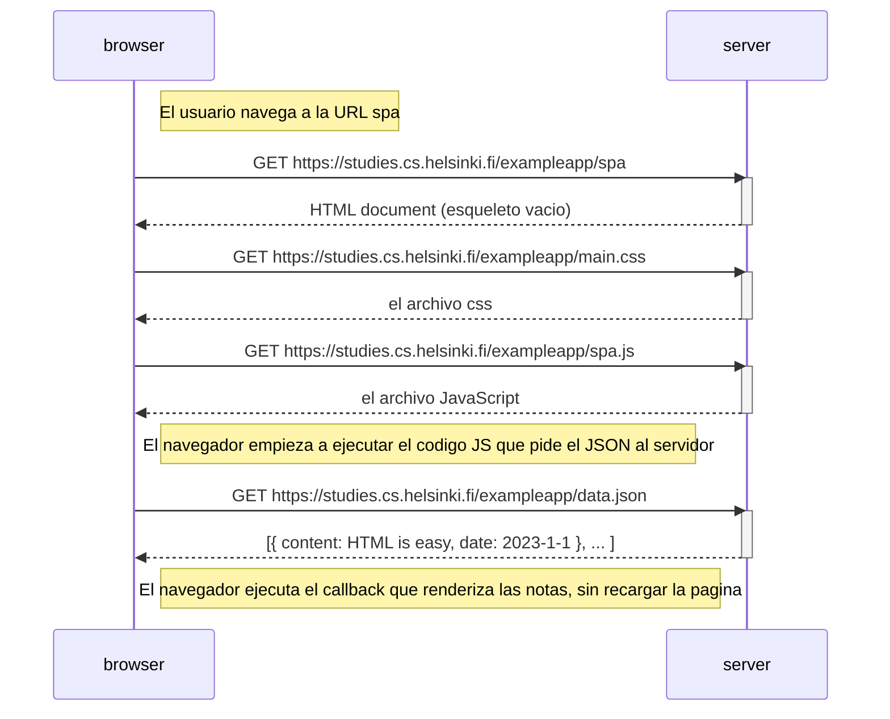

```mermaid
sequenceDiagram
    participant browser
    participant server
    Note right of browser: El usuario navega a la URL spa
    browser->>server: GET https://studies.cs.helsinki.fi/exampleapp/spa
    activate server
    server-->>browser: HTML document (esqueleto vacio)
    deactivate server
    browser->>server: GET https://studies.cs.helsinki.fi/exampleapp/main.css
    activate server
    server-->>browser: el archivo css
    deactivate server
    browser->>server: GET https://studies.cs.helsinki.fi/exampleapp/spa.js
    activate server
    server-->>browser: el archivo JavaScript
    deactivate server
    Note right of browser: El navegador empieza a ejecutar el codigo JS que pide el JSON al servidor
    browser->>server: GET https://studies.cs.helsinki.fi/exampleapp/data.json
    activate server
    server-->>browser: [{ content: HTML is easy, date: 2023-1-1 }, ... ]
    deactivate server
    Note right of browser: El navegador ejecuta el callback que renderiza las notas, sin recargar la pagina
```
