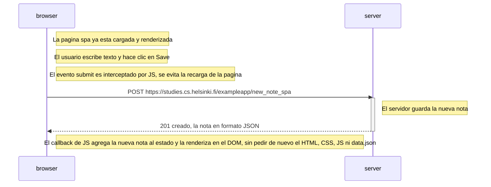

```mermaid

sequenceDiagram
    participant browser
    participant server
    Note right of browser: La pagina spa ya esta cargada y renderizada
    Note right of browser: El usuario escribe texto y hace clic en Save
    Note right of browser: El evento submit es interceptado por JS, se evita la recarga de la pagina
    browser->>server: POST https://studies.cs.helsinki.fi/exampleapp/new_note_spa
    activate server
    Note right of server: El servidor guarda la nueva nota
    server-->>browser: 201 creado, la nota en formato JSON
    deactivate server
    Note right of browser: El callback de JS agrega la nueva nota al estado y la renderiza en el DOM, sin pedir de nuevo el HTML, CSS, JS ni data.json

```
